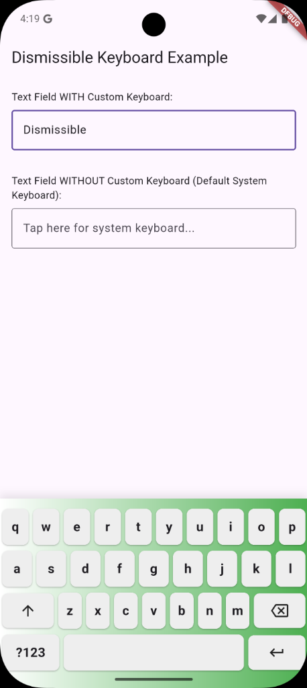

# Flutter Dismissible Keyboard

A lightweight, pure Dart Flutter package that provides a `DismissibleKeyboard` wrapper. This allows you to show and hide a custom keyboard widget (like a numeric keypad, custom calculator, or special character layout) whenever a specific `TextField` gains or loses focus. 

It perfectly mimics the standard system keyboard's sliding up and sliding down behavior.



## Features

- **Seamless Focus Handling:** Automatically listens to your `TextField`'s `FocusNode`.
- **System Keyboard Suppression:** When configured with `keyboardType: TextInputType.none`, it prevents the OS system keyboard from appearing while taking its place.
- **Custom Keyboard Support:** Pass **ANY** Flutter widget as your custom keyboard (e.g. `future_keyboard_kit`, a simple numeric pad, or a full custom view).
- **Native Animations:** Included sliding transitions that match standard OS interactions.
- **Pure Dart:** No native Android or iOS boilerplate. Works instantly across all Flutter platforms.

## Getting Started

Add this package to your `pubspec.yaml`:

```yaml
dependencies:
  flutter_dismissible_keyboard: ^0.0.1
```

## Setup & Usage

To use it, wrap your `TextField` with `DismissibleKeyboard`. 

### Required Steps:
1. Create a `FocusNode` and assign it to BOTH the `DismissibleKeyboard` and the `TextField`.
2. Set `keyboardType: TextInputType.none` on your `TextField` to stop the default OS keyboard from popping up.
3. Pass your custom UI as the `customKeyboard` parameter.

### Example Code

```dart
import 'package:flutter/material.dart';
import 'package:flutter_dismissible_keyboard/flutter_dismissible_keyboard.dart';
// Optional: you can use packages like future_keyboard_kit for the UI
// import 'package:future_keyboard_kit/future_keyboard_kit.dart';

class MyKeyboardScreen extends StatefulWidget {
  @override
  _MyKeyboardScreenState createState() => _MyKeyboardScreenState();
}

class _MyKeyboardScreenState extends State<MyKeyboardScreen> {
  final FocusNode _focusNode = FocusNode();
  final TextEditingController _controller = TextEditingController();

  @override
  void dispose() {
    _focusNode.dispose();
    _controller.dispose();
    super.dispose();
  }

  @override
  Widget build(BuildContext context) {
    return Scaffold(
      appBar: AppBar(title: const Text('Custom Keyboard Demo')),
      body: Padding(
        padding: const EdgeInsets.all(16.0),
        child: Column(
          children: [
            DismissibleKeyboard(
              // 1. Pass the FocusNode
              focusNode: _focusNode,
              
              // 2. Build your custom keyboard UI
              customKeyboard: Container(
                  padding: const EdgeInsets.only(bottom: 20, top: 10),
                  decoration: BoxDecoration(
                    color: Colors.white,
                    gradient: LinearGradient(
                      colors: [Colors.white, Colors.green],
                    ),
                    boxShadow: const [
                      BoxShadow(
                        color: Color.fromRGBO(0, 0, 0, 0.1),
                        blurRadius: 10,
                        offset: Offset(0, -5),
                      ),
                    ],
                  ),
                  child: FlutterKeyboard(
                    controller: _controller,
                    layout: VirtualKeyboardLayout.alphanumeric(),
                    onSubmitted: (_) => _customKeyboardFocusNode.unfocus(),
                    style: VirtualKeyboardStyle(
                      backgroundColor: Colors.transparent,
                      keyBackgroundColor: Colors.grey.shade200,
                      keyBorderRadius: 8.0,
                      keyTextStyle: const TextStyle(
                        fontSize: 18,
                        fontWeight: FontWeight.bold,
                      ),
                    ),
                  ),
                ),
              
              // 3. Wrap your TextField
              child: TextField(
                controller: _controller,
                focusNode: _focusNode,
                
                // 4. MUST be TextInputType.none to hide system keyboard
                keyboardType: TextInputType.none,
                decoration: const InputDecoration(
                  labelText: 'Tap me!',
                  border: OutlineInputBorder(),
                ),
              ),
            ),
          ],
        ),
      ),
    );
  }
}
```

## How to Dismiss

The custom keyboard disappears automatically whenever the wrapped `TextField` loses focus. 
You can manually trigger this (for example, with a "Done" button on your keyboard) by simply calling:

```dart
_focusNode.unfocus();
```
